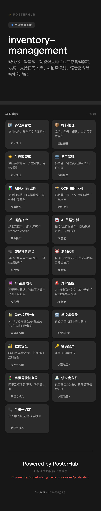
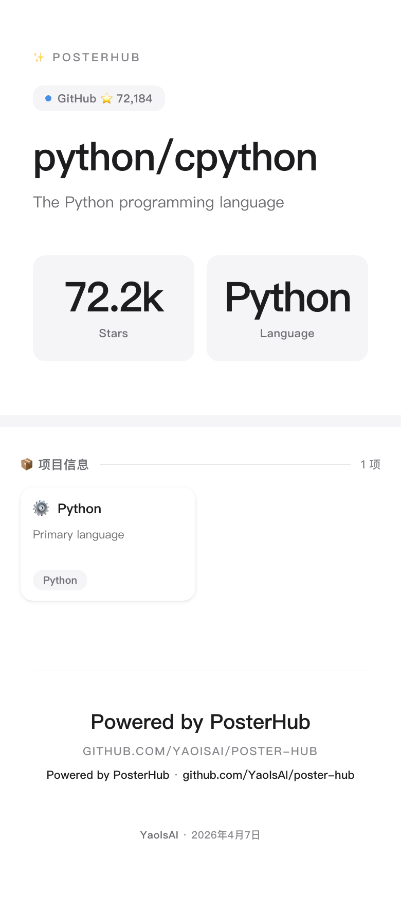
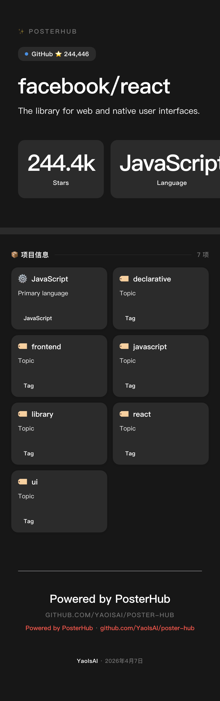

# 🖼️ PosterHub

### AI-Powered Project Poster Generator

> 输入 GitHub URL、本地项目路径或项目描述，AI 自动分析并生成专业项目海报。

[English](README_EN.md) · [快速开始](#-快速开始) · [示例](#-示例海报) · [API 文档](docs/API.md)

---

[](package.json)
[](LICENSE)
[](https://github.com/YaoIsAI/poster-hub/stargazers)

---

## 🎯 是什么

PosterHub 是一个**本地优先**的 AI 海报生成工具。

你可以输入：
- GitHub 仓库 URL
- 本地项目路径
- 自然语言项目描述

系统会自动分析项目上下文并生成高质量可分享海报。

---

## 🧭 架构图

PosterHub 采用本地优先的双端协作结构：

```text
┌─────────────────────────────────────────────┐
│  客户端（浏览器 / AI 助手）                  │
│                                             │
│  输入：GitHub URL / 本地路径 / 项目描述      │
│       ↓                                      │
│  AI 读取 SKILL.md 并学习技能                 │
│       ↓                                      │
│  调用：POST /api/generate 或 /api/prompt     │
└─────────────────┬───────────────────────────┘
                  ↓
┌─────────────────────────────────────────────┐
│  PosterHub 服务端（localhost:3008）          │
│                                             │
│  1. 解析输入 → GitHub API / 本地扫描          │
│  2. AI 分析 → OpenAI 兼容 LLM                │
│  3. 生成海报 → HTML + CSS                    │
│  4. 导出 PNG → Chromium 全页截图             │
│       ↓                                      │
│  返回：posterId → /api/poster/:id.png        │
└─────────────────────────────────────────────┘
```

**关键点：**
- AI 助手可通过 `SKILL.md` 自动学习技能
- 海报自动带项目 GitHub 链接，便于传播
- 支持任意 OpenAI 兼容 LLM（DeepSeek/Qwen/OpenAI 等）

---

## ✨ 特性

- 🤖 **AI 驱动**：输入任意项目，自动分析并生成海报
- 📁 **本地项目分析**：扫描本地目录并结合 LLM 提取内容
- 🧩 **双生成链路**：`POST /api/generate`（项目海报）+ `POST /api/prompt`（风格海报）
- 🔁 **闭环审查**：`/api/prompt` 采用“规划 -> 生成 -> 审查 -> 自动纠偏 -> 再审查”流程，审查通过后才导出 PNG
- 🌐 **中英双语**：界面与海报内容支持中文/英文
- 🪄 **多风格类型**：`wechat` / `xiaohongshu` / `performance` / `corporate` / `custom`
- 📱 **高清导出**：原生 780px 宽，高清 PNG 输出
- ⚙️ **设置页能力**：内置 LLM 连通性测试、模型列表刷新与选择
- 🖥️ **Web 界面**：浏览器直接使用
- 🔗 **GitHub 集成**：自动获取仓库信息
- ⚡ **本地运行**：克隆即用，依赖精简

---

## 📸 示例海报

| 主题 | 预览 |
|------|------|
| Apple 极简风 |  |
| 深色科技风 |  |
| Python 风格 |  |
| React + Vercel |  |

更多示例见 [examples/](examples/)

---

## 🚀 快速开始

### 第一步：安装

```bash
git clone https://github.com/YaoIsAI/poster-hub.git
cd poster-hub
npm install
npx @sparticuz/chromium install
```

### 第二步：启动服务

```bash
node server.js
# 服务运行在 http://localhost:3008
```

### 第三步：使用（3 种方式）

#### 方式 A：Web 界面（最简单）
打开 http://localhost:3008，粘贴 GitHub URL，点击“生成”。

#### 方式 B：让 AI 助手调用（推荐）
安装技能后直接说：

```text
帮我生成 facebook/react 的海报
分析 ~/my-projects/web-app 并生成一张海报
```

#### 方式 C：CLI / API

```bash
curl -X POST http://localhost:3008/api/generate \
  -H "Content-Type: application/json" \
  -d '{"nl": "https://github.com/facebook/react", "lang": "zh", "inputType": "url"}'
```

---

## 🤖 AI 助手集成（OpenClaw）

### 工作方式

OpenClaw 会自动扫描 `~/.openclaw/workspace/skills/` 下的 `SKILL.md` 并学习技能定义。

**给 OpenClaw 的最简描述（推荐直接复制）：**

```text
学习 https://raw.githubusercontent.com/YaoIsAI/poster-hub/main/SKILL.md，并在我说“生成项目海报”时自动调用它。
```

PosterHub 被学习后，AI 助手会：
1. 理解“生成海报”的用户意图
2. 解析 GitHub URL 或本地路径
3. 调用 PosterHub API
4. 返回海报链接给用户

### 首次使用建议（让 AI 主动引导用户）

建议 AI 在首次调用时主动提示用户完成以下配置：

1. 打开设置页：`http://localhost:3008/web/settings.html`
2. 配置 `LLM_BASE_URL`、`LLM_MODEL`、`LLM_API_KEY`
3. 点击“测试 LLM 连通性”
4. 可选配置 `GITHUB_TOKEN`（避免 GitHub API 限流）

### 安装步骤

```bash
# 克隆到 OpenClaw skills 目录
mkdir -p ~/.openclaw/workspace/skills
git clone https://github.com/YaoIsAI/poster-hub.git ~/.openclaw/workspace/skills/poster-hub

cd ~/.openclaw/workspace/skills/poster-hub
npm install

# 确保 PosterHub 服务已启动
node server.js
```

### 给你自己的项目添加海报生成能力

将 `SKILL.md` 放到你的 GitHub 仓库根目录，AI 助手就能为该项目生成海报：

```bash
# 1. 复制模板
cp poster-hub/SKILL.md /path/to/your-project/

# 2. 编辑 name 和 description

# 3. 提交并推送
git add SKILL.md && git commit -m "Add PosterHub skill"
git push
```

---

## 💬 给 AI 的示例话术

安装 PosterHub 后，可以直接对 AI 发送这些指令：

### 示例 1：GitHub 项目海报
```text
帮我生成 facebook/react 的海报
给 https://github.com/microsoft/vscode 做一张海报
```

### 示例 2：本地项目海报（模糊描述也可）
```text
给 ~/my-projects/web-app 生成海报
帮我看看这个项目并生成海报
分析当前项目并出一张海报
```

### 示例 3：任意项目
```text
给一个 Vue.js 项目做海报
帮我的 Node.js 后端项目生成介绍图
```

### 示例 4：通过 Web 页面
打开 http://localhost:3008，粘贴任意 GitHub URL 后点击“生成”。

---

## 🎯 适用场景

- 📱 小程序 / APP 宣传海报
- 🛠️ AI 工具 / Skill 能力介绍
- 👤 个人品牌与作品展示
- 🏢 企业产品与活动传播
- 📦 开源项目快速介绍
- 🔬 技术研究成果分享

---

## 📂 项目结构

```text
poster-hub/
├── SKILL.md              # AI 技能定义（供 AI 学习）
├── README.md             # 中文文档
├── README_EN.md          # 英文文档
├── server.js             # HTTP API 服务（3008）
├── generator.js          # 项目海报 HTML/CSS 生成引擎
├── prompt-generator.js   # 通用风格海报生成器
├── design-system.js      # 设计 token / 设计规范解析器
├── poster-generator.js   # 自适应 CSS 海报生成器
├── screenshot.js         # Chromium 全页截图输出 PNG
├── local-llm.js          # OpenAI 兼容 LLM 项目分析
├── generate-poster.js    # CLI 工具
├── web/
│   ├── index.html        # 生成器页面
│   ├── gallery.html      # 历史海报画廊
│   ├── settings.html     # 设置页面（LLM 连接测试 / 模型刷新）
│   └── css/style.css     # 前端样式
└── posters/              # 生成海报本地存储
```

**文件职责：**

| 文件 | 职责 |
|------|------|
| `server.js` | HTTP API、路由、GitHub API 调用 |
| `generator.js` | 项目海报生成、主题系统、i18n |
| `local-llm.js` | 本地项目 LLM 分析 |
| `screenshot.js` | 全页 PNG 截图 |
| `web/index.html` | 生成器 UI |
| `web/gallery.html` | 历史海报画廊 |

---

## 🔌 API 参考

### 生成项目海报
```http
POST /api/generate
Content-Type: application/json

{
  "nl": "GitHub URL / 本地路径 / 项目描述",
  "lang": "zh" | "en",
  "inputType": "url" | "browse"
}
```

返回示例：
```json
{
  "ok": true,
  "posterId": "1775490000000-xxxx",
  "title": "Project Title",
  "github": "https://github.com/owner/repo",
  "stars": 12345,
  "warnings": []
}
```

### 生成通用风格海报
```http
POST /api/prompt
Content-Type: application/json

{
  "prompt": "生成一张微信风格海报，介绍某 AI 工具",
  "type": "wechat" | "xiaohongshu" | "performance" | "corporate" | "custom",
  "lang": "zh" | "en",
  "width": 780
}
```

### 获取风格类型列表
```http
GET /api/types
```

### 下载海报 PNG
```http
GET /api/poster/:posterId.png
```

### 获取海报元数据
```http
GET /api/poster/:posterId/meta.json
```

### 获取海报列表
```http
GET /api/list
```

### 获取 / 保存设置
```http
GET /api/settings
POST /api/settings
POST /api/settings/test
GET /api/models
GET /api/progress/:progressId
```

详见 [docs/API.md](docs/API.md)

---

## 📋 海报包含内容

| 模块 | 内容 |
|------|------|
| Hero | 项目名 + 描述 + ⭐ Stars |
| Stats | 关键指标（如文件数 / 模块数等） |
| Tech Stack | 检测到的语言与框架 |
| Modules | 主要功能模块 |
| Footer | 品牌标识 + 生成信息 + 项目链接 |

---

## 🌐 双语支持

- UI 支持中文 / 英文切换
- 海报标签会根据 `lang` 自动切换
- API 参数：`lang: "zh"` / `lang: "en"`

---

## 🎨 内置主题

| 主题 ID | 风格 |
|---------|------|
| `apple-minimal` | Apple 极简风 |
| `warm-earth` | 暖棕大地风 |
| `tech-blue` | 科技蓝风格 |
| `creative` | 创意渐变风 |

---

## 🐳 Docker 部署

### 快速启动

```bash
# 克隆项目
git clone https://github.com/YaoIsAI/poster-hub.git
cd poster-hub

# 创建环境变量文件
cp .env.example .env
# 编辑 .env 填入你的配置

# 启动服务
docker-compose up -d

# 查看日志
docker-compose logs -f
```

### 使用现有镜像

```bash
# 仅使用 docker-compose.yml（使用预构建镜像）
wget https://raw.githubusercontent.com/YaoIsAI/poster-hub/main/docker-compose.yml
docker-compose up -d
```

### 环境变量

| 变量 | 说明 | 默认值 |
|------|------|--------|
| `GITHUB_TOKEN` | GitHub API Token | 无 |
| `LLM_API_KEY` | OpenAI 兼容 API Key | 无 |
| `LLM_BASE_URL` | LLM API 端点 | MiniMax |
| `LLM_MODEL` | LLM 模型名 | MiniMax-M2.1 |
| `PORT` | 服务端口 | `3008` |

### NAS 部署示例

```bash
# 在绿联 NAS 上
ssh user@192.168.31.85 -p 2222
mkdir -p ~/poster-hub && cd ~/poster-hub
# 上传 docker-compose.yml
docker-compose up -d
```

### 健康检查

```bash
curl http://localhost:3008/health
```

---

## ⚙️ 配置

环境变量（可选）：

| 变量 | 说明 | 默认值 |
|------|------|--------|
| `GITHUB_TOKEN` | GitHub API Token（提升限流阈值） | 无 |
| `LLM_API_KEY` | OpenAI 兼容 API Key（用于 AI 分析） | 无 |
| `LLM_BASE_URL` | LLM API 端点（默认 MiniMax） | MiniMax 默认值 |
| `LLM_MODEL` | LLM 模型名（默认 MiniMax-M2.1） | MiniMax-M2.1 |
| `PORT` | 服务端口 | `3008` |
| `POSTER_LOGO_PATH` | 自定义 Logo 路径 | 无 |
| `POSTER_BRAND_NAME` | 海报底部品牌名称 | `PosterHub` |

```bash
cp .env.example .env
# 编辑 .env 填入你的配置
```

也可以直接在 `http://localhost:3008/web/settings.html` 可视化配置并测试连通性。

---

## ⚠️ 常见问题

**Q: AI 说“无法生成海报”？**  
确认服务已启动：`node server.js`

**Q: GitHub 信息不完整（stars = 0）？**  
建议配置 `GITHUB_TOKEN`（未配置时限流较低）。

**Q: 海报内容太简略？**  
建议配置 `LLM_API_KEY` 以启用完整 AI 分析。

**Q: 生成图片为空白？**  
安装 Chromium：`npx @sparticuz/chromium install`

---

## 📄 License

MIT License

---

## 🤝 贡献

欢迎提交 Issue 和 PR！
